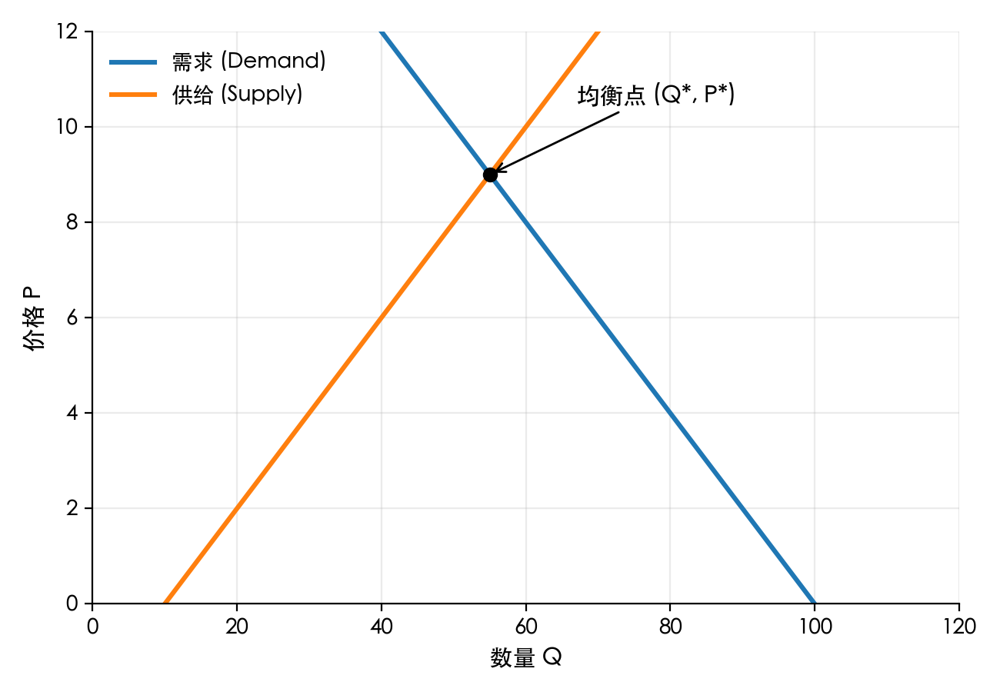
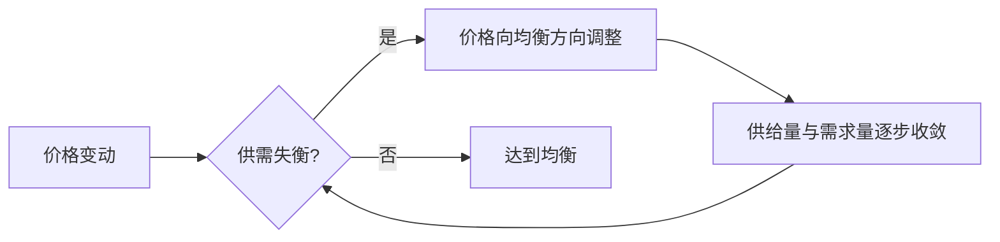

# 供给与需求基础

> 零基础入门：理解市场价格如何由买方和卖方共同决定。

## 学习目标

- 掌握需求、需求量、供给、供给量等概念区别。
- 能够用文字解释“需求曲线向下倾斜、供给曲线向上倾斜”的直观原因。
- 理解市场均衡如何形成，以及非价格因素是如何使曲线移动的。
- 初步运用供需分析解释现实中的价格变化。

## 核心术语

- **需求 (Demand)**：在既定时期内，消费者在不同价格下愿意且能够购买的全部数量关系。
- **需求量 (Quantity Demanded)**：在特定价格下，消费者愿意且能够购买的具体数量。
- **供给 (Supply)**：生产者在不同价格下愿意且能够出售的全部数量关系。
- **供给量 (Quantity Supplied)**：在特定价格下，生产者愿意且能够出售的具体数量。
- **均衡价格 (Equilibrium Price)**：需求量与供给量相等时的价格。
- **均衡数量 (Equilibrium Quantity)**：在均衡价格下交易的数量。

### 如何区分“需求”和“需求量”

- **需求** 描述的是一整条曲线，记录“每个可能价格下买家愿意买多少”。就像一张“价格—数量对照表”。
- **需求量** 是曲线上的“一个点”，即“在 10 元这个价格，我愿意买 3 个”。价格改变，点会沿曲线移动，但曲线整体并未变化。
- 记忆法：把需求想象成“关系”，需求量是“关系里的具体条目”。

供给与供给量的区分与上面完全相同。

## 如何读供需图？

1. **画坐标轴**：纵轴写“价格 (P)”，横轴写“数量 (Q)”。
2. **画需求线**：从左上往右下画一条下降的平滑曲线（示意时常画成直线），代表“价格越高，能买得起的人越少”。这条线就是需求曲线。
3. **画供给线**：从左下往右上画一条上升的平滑曲线，同样可用直线做示意，代表“价格越高，生产者越愿意卖”。这条线是供给曲线。
4. **找交点**：两条线的交点对应均衡价格 P\* 与均衡数量 Q\*。

> 图中蓝线为需求曲线、橙线为供给曲线，交点即均衡。实际曲线不一定完全线性，但方向“需求向下、供给向上”保持不变。

### 关于曲线形状的小提示

- 需求或供给曲线在现实中往往是弯曲的，具体形状取决于消费者和生产者对价格变化的敏感度（弹性）。
- 教材常用直线是为了便于手算、画图和说明概念，本质上是一种简化假设。
- 如果需求对价格变化越来越敏感，曲线可能呈现弧形；极端情况下，曲线甚至可能出现“折点”（例如价格管制导致的水平线段）。

### 一个简单的数值例子

| 价格 (元) | 需求量 (件) | 供给量 (件) |
| -------- | ----------- | ----------- |
| 10       | 90          | 10          |
| 8        | 70          | 30          |
| 6        | 50          | 50          |
| 4        | 30          | 70          |
| 2        | 10          | 90          |

- 当价格为 6 元时，需求量与供给量都等于 50，就是均衡点。
- 价格越高，需求量越少、供给量越多；价格越低，反之亦然。

## 需求曲线为何向下倾斜？

1. **替代效应**：价格上升时，消费者转向更便宜的替代品，需求量下降。
2. **收入效应**：价格上升使购买力下降，消费者能买的数量减少。
3. **边际效用递减**：多消费一单位带来的额外满足感降低，愿意支付的价格也随之下降。

> 记忆技巧：把需求曲线想象成“消费者的最高愿付价格”集合。愿付价格越高的人越少，所以曲线向下。

更生活化的理解：
- 先把所有消费者按“最高愿意给多少钱”从高到低排队；愿付价格越高的人越少，所以曲线往右走时高度会自然下降。
- 一个价格点只反映“这群人里谁能买得起”，价格越高，能留下的人越少。
- 当商品不再稀缺时，额外那一份带来的满足感不高，消费者自然不愿继续支付高价。

## 供给曲线为何向上倾斜？

1. **成本上升**：产量增加时，需要使用成本更高的资源或加班生产，提高均衡价格。
2. **利润动机**：更高价格带来更高利润，吸引更多生产者进入或扩大生产。

> 直观类比：农民愿意在玉米价格高时增加播种面积，因为额外劳动带来的收益更高。

换个角度：
- 如果市场价太低，商家宁可把资源用到别的商品上；只有价格足够高，才值得投入稀缺资源。
- 更高的售价是对额外成本的补偿，所以供应者会等待价格上涨后再扩大生产。

## 市场均衡的形成

- 当价格 **高于** 均衡价格：供给量 > 需求量，出现 **过剩**。库存压力会促使卖方降价。
- 当价格 **低于** 均衡价格：需求量 > 供给量，出现 **短缺**。抢购会推动价格上升。
- 市场通过价格信号不断调整，直至供需相等。

可以把市场想象成一个不停喊价的集市：
- 卖家发现多余库存，会主动降价吸引买家；竞争让价格不断向下挤压。
- 买家抢不到货时，会出更高价格排队，反过来刺激卖家增加供给。
- 这一来一往就是“看不见的手”，直到达到没人想再调价的平衡点。

- **价格变动**：无论是买家出价变化还是卖家调价，都会触发后续反应。
- **供需失衡?**：检查此时的供给量与需求量是否相等。
- **价格向均衡方向调整**：若不相等，价格会朝着缓解短缺或过剩的方向移动。
- **供给量与需求量逐步收敛**：随着价格调整，买卖双方数量逐渐接近。
- **达到均衡**：当两者相等时，进一步调价的动力消失，市场进入均衡状态。

## 曲线移动 vs. 沿曲线移动

- **沿曲线移动**：价格变化导致数量变化（例如价格上涨→需求量下降）。
- **曲线移动**：非价格因素变化使得整个需求或供给曲线平移。

### 需求曲线移动因素
- 消费者收入（正常品 vs. 劣等品）
- 偏好变化
- 替代品或互补品价格
- 预期（未来价格、收入）
- 人口规模

### 供给曲线移动因素
- 生产成本（原材料、工资、税收、补贴）
- 技术进步
- 生产者数量
- 价格预期
- 其它自然因素（天气、灾害）

> 小结：价格变化 → 沿曲线移动；其他因素变化 → 曲线平移。

分析技巧：
- 先问“这件事改变的是愿付价格（买方）还是成本结构（卖方）？”
- 再判断“是让人更愿意买/卖，还是更不愿意？”于是得出“曲线右移或左移”。
- 最后回到图上，比较移动后的新均衡位置。

## 简单案例：鸡蛋价格波动

1. 春节前，消费者需求增加（节日消费、礼盒需求），需求曲线右移 → 价格和数量同时上升。
2. 若鸡饲料价格大幅上涨，生产成本提高，供给曲线左移 → 价格上升、数量下降。
3. 当供给和需求同时变化时，需要比较移动幅度才能判断最终价格与数量。

阅读案例时，可以按以下顺序分析：
1. **定位事件影响哪一方**：节日消费影响买方，饲料成本影响卖方。
2. **判断方向**：买方更愿买 → 需求右移；卖方成本更高 → 供给左移。
3. **找新交点**：需求右移一般让价格、数量都上升；供给左移则推高价格、压低数量。
4. **综合比较**：供需同时动时，价格不一定是原来那种直觉，需要看哪条移动幅度更大。

## 快速自测

1. 解释“需求量减少”和“需求减少”的区别。
2. 一场科技创新让电动车生产成本大幅下降，这将如何影响电动车市场的价格与数量？
3. 若政府对牛奶设定高于均衡价格的价格下限，会发生什么？

### 参考答案与解析

1. **需求量减少**：因为价格上涨，在同一条需求曲线上向左移动；**需求减少**：因为收入下降、偏好改变等非价格因素，整条需求曲线向左平移。
2. 技术进步降低成本 → 供给曲线整体右移。更低的价格吸引更多消费者，均衡价格下降、均衡数量上升；如果技术同时提升了消费者偏好，需求也可能右移，销量增长更明显。
3. 价格下限高于均衡价 → 市场出现过剩。买家买不起那么多，卖家却因高价愿意多生产，过剩需要政府收购、存储或强制配给，否则会造成浪费和黑市。

## 延伸阅读

- 《经济学原理》（曼昆）第 1 部分
- Khan Academy：Intro to Supply and Demand
- Coursera：Yale Financial Markets 课程中的市场机制章节

---

准备好后，继续学习 `02-elasticity.md`，理解需求与供给对价格变化的敏感度。
