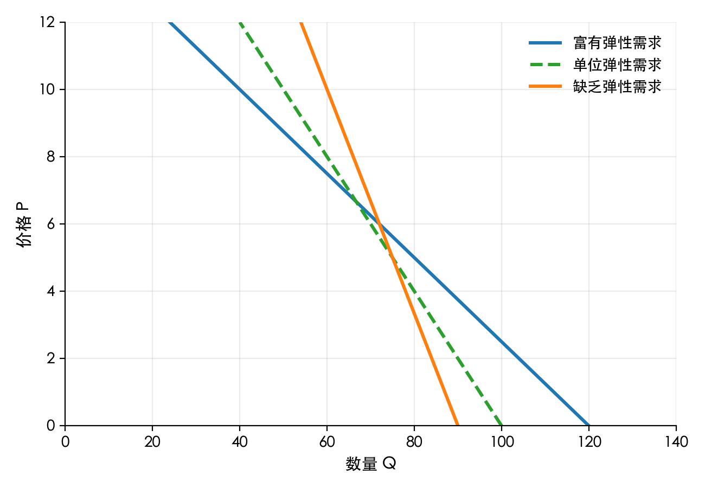

# 弹性基础（Elasticity）

> 掌握“曲线斜率背后的敏感度”，理解价格、收入等变动对市场行为的影响。

## 学习目标

- 理解“弹性”在供需分析中的作用，区分弹性大小与曲线陡缓。
- 掌握价格弹性的定义、计算方式，以及常见取值区间的意义。
- 学会使用总收入测试、图像和直觉判断需求的弹性类型。
- 了解其他常见弹性：收入弹性、交叉价格弹性、供给价格弹性。
- 能够用弹性分析解释现实中的价格波动和政策效果。

## 什么是弹性？

- **弹性 (Elasticity)** 衡量的是一个变量对另一个变量变动的敏感程度，即“成比例的反应幅度”。
- 在供需分析中，最常见的是 **需求的价格弹性**：价格变化 1%，需求量变化了多少百分比。
- 与斜率 (slope) 不同：斜率是“绝对变化量”，弹性关注“相对（百分比）变化”，因此更适合比较不同商品或不同价格区间。

## 需求的价格弹性

### 定义公式

```math
E_d = \frac{需求量的百分比变化}{价格的百分比变化}
    = \frac{\Delta Q / Q}{\Delta P / P}
```

- `E_d < 0`（因为价格和需求量反向变化），通常讨论的是绝对值 `|E_d|`。
- 当 `|E_d| > 1`，称为 **富有弹性 (elastic)**：价格略有变化，需求量变化更大。
- 当 `|E_d| = 1`，称为 **单位弹性**。
- 当 `|E_d| < 1`，称为 **缺乏弹性 (inelastic)**：需求量对价格变化不敏感。

### 中点法计算（实用公式）

为了避免“从 A 到 B 与从 B 到 A 结果不同”，通常采用中点法：

```math
E_d = \frac{(Q_2 - Q_1) / ((Q_1 + Q_2) / 2)}{(P_2 - P_1) / ((P_1 + P_2) / 2)}
```

> 记忆口诀：用“平均值”当作基准，把变化量与平均值的比例相除。

### 影响需求价格弹性的因素

- 替代品的多少：替代品越多，弹性越高。
- 必需品 vs. 奢侈品：必需品往往缺乏弹性，奢侈品弹性较高。
- 商品定义范围：越具体的商品（例如“黑巧克力”）弹性越高。
- 时间跨度：时间越长，消费者调整行为的余地越大，弹性越高。

## 弹性与总收入

- **总收入 (Total Revenue, TR) = 价格 × 销售数量**。
- 当需求 **富有弹性** (`|E_d| > 1`)：降价会让销量增幅更大 → 总收入上升；涨价会导致总收入下降。
- 当需求 **缺乏弹性** (`|E_d| < 1`)：降价带来的销量增幅不足以抵消价格下降 → 总收入下降；涨价反而能提高总收入。
- 当需求 **单位弹性** (`|E_d| = 1`)：价格变化不会影响总收入（增减相抵）。

> 快速判断：营业额 = 价 × 量。如果量的变动幅度（弹性）更大，量的影响主导；否则价格主导。

## 供给的价格弹性

- **供给价格弹性 (E_s)** 的定义与需求类似，只是把视角转到生产者：

```math
E_s = \frac{供给量的百分比变化}{价格的百分比变化}
```

- 供给曲线的弹性决定了生产者对价格变化的反应速度。
- 时间同样是关键：短期内产能固定（弹性小），长期可以扩建工厂或进入行业（弹性大）。

## 其他常见弹性

- **收入弹性 (Income Elasticity)**：消费者收入变化 1%，需求量变化多少。
  - 正常品：收入弹性 > 0；奢侈品弹性通常 > 1；劣等品弹性 < 0。
- **交叉价格弹性 (Cross-price Elasticity)**：相关商品价格变动 1%，目标商品需求量变动多少。
  - 替代品：交叉价格弹性 > 0（A 涨价 → B 需求量上升）。
  - 互补品：交叉价格弹性 < 0（油价涨 → 汽车需求下降）。

## 图像直觉：曲线陡缓与弹性

- **越陡的曲线 → 弹性越小**（数量对价格变化反应小）。
- **越平的曲线 → 弹性越大**。
- 垂直线是完全缺乏弹性（例如救命药），水平线是完全富有弹性（例如完全竞争中的价格接受者）。



## 简单案例：打车平台调价

- 雨天时打车需求更迫切（替代品少、需求缺乏弹性），平台涨价仍能保持较高订单量，总收入上升。
- 晴天时用户有更多出行方式（替代品多、需求弹性大），涨价容易流失客户，反而降低总收入。
- 平台会根据实时需求弹性调整价格，以平衡司机供给与乘客需求。

## 快速自测

1. 一件商品价格从 20 元降到 18 元，销量从 100 件增至 130 件。使用中点法计算需求价格弹性，并判断弹性类型。
2. 某奢侈品收入弹性为 2.5，如果消费者收入下降 10%，需求量会变化多少？
3. 某品牌咖啡的交叉价格弹性相对于茶叶为 -0.3，这意味着什么？

### 参考答案与解析

1. 价格变化比例 = `(18-20)/((18+20)/2) = -2/19 ≈ -0.1053`；数量变化比例 = `(130-100)/((130+100)/2) = 30/115 ≈ 0.2609`。弹性 `E_d ≈ 0.2609 / -0.1053 ≈ -2.48`，取绝对值约 2.48，属于富有弹性。
2. 收入弹性 2.5，收入下降 10% → 需求下降 `2.5 × 10% = 25%`。说明奢侈品需求对收入变化非常敏感。
3. 交叉价格弹性为 -0.3：茶叶价格每上涨 1%，咖啡需求下降 0.3%。两者是互补关系（例如消费者喝咖啡时常搭配某种茶点）。

## 延伸阅读

- 《经济学原理》（曼昆）关于弹性的章节
- Khan Academy：Elasticity lessons
- 《微观经济学：现代观点》（Varian）第 15 章（深入弹性与应用）

---

完成本节后，可以返回供需模型，结合弹性讨论税收、补贴与价格管制对市场的影响。
