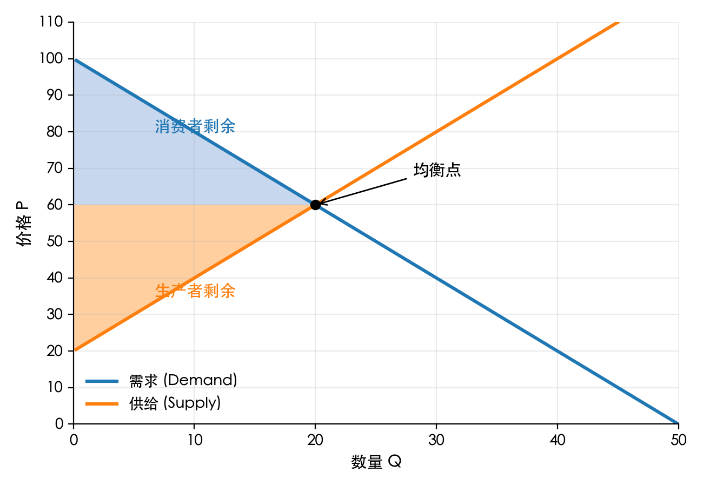

# 消费者与生产者剩余（Surplus）

> 理解市场交易带来的“额外收益”，以及政策干预如何改变市场效率。

## 学习目标

- 掌握消费者剩余、生产者剩余的定义与图像表示，熟悉“支付意愿 / 接受意愿”概念。
- 能够用简单的几何面积计算市场剩余，并判断市场是否有效率。
- 理解价格管制、税收等政策产生的无谓损失（deadweight loss），以及弹性对损失大小的影响。
- 学会用剩余分析评估案例，例如房租管制、消费税、补贴等。

## 核心概念

- **消费者剩余 (Consumer Surplus, CS)**：消费者愿意支付的最高价格与实际支付价格之间的差额。在图上是需求曲线与市场价格之间、至交易数量为止的面积。
- **生产者剩余 (Producer Surplus, PS)**：生产者实际收到的价格与愿意接受的最低价格之间的差额。图上是市场价格与供给曲线之间、至交易数量为止的面积。
- **社会总剩余 (Total Surplus, TS)**：`TS = CS + PS`，衡量市场中的总体福利。
- **无谓损失 (Deadweight Loss, DWL)**：当市场未能达到均衡交易量时，原本可以创造的剩余被浪费掉，表现为“未被实现的三角形面积”。

> 图中蓝色区域是消费者剩余，橙色区域是生产者剩余。若均衡交易量被压缩或扩大（如税收、补贴、配额），便会出现灰色的无谓损失区域。

## 如何计算剩余？

在简单线性模型下：

- 消费者剩余 ≈ `0.5 × 底边（交易数量） × 高度（最高愿付价与市场价的差）`
- 生产者剩余 ≈ `0.5 × 底边（交易数量） × 高度（市场价与最低可接受价的差）`

更一般地，需要对需求与供给曲线做积分，不过对于初学者，掌握线性近似即可应对大部分练习题。

### 数值例子

- 市场需求：`P = 100 - 2Q`，市场供给：`P = 20 + 2Q`
- 均衡条件 `100 - 2Q = 20 + 2Q` → 均衡数量 `Q* = 20`，均衡价格 `P* = 60`
- 消费者愿付的最高价格：当 `Q = 0` 时 `P = 100`
- 生产者愿意接受的最低价格：当 `Q = 0` 时 `P = 20`

计算：

- `CS = 0.5 × 20 × (100 - 60) = 400`
- `PS = 0.5 × 20 × (60 - 20) = 400`
- `TS = 800`

由于供需对称，该例中消费者与生产者剩余相等。

## 政策干预与无谓损失

### 价格上限（如房租管制）

- 价格被压低在均衡价下：交易量减少 → 出现短缺。
- 剩余变化：一部分消费者以低价成交得到额外剩余，但有些原本愿意交易的消费者买不到房。
- 结果：消费者剩余额一般不一定上升，生产者剩余下降，无谓损失产生。
- 弹性越大 → 交易量减少越多 → 无谓损失越大。

### 价格下限（如农业保障价格）

- 价格被抬高在均衡价上：交易量减少 → 出现过剩。
- 生产者剩余可能增加（政府通常收购过剩产品），消费者剩余下降。
- 无谓损失同样来自于被迫放弃的互利交易。

### 税收

- 征收单位税 `T` 会使供给曲线向上平移或需求曲线向下平移（视税负对象而定）。
- 均衡数量下降，消费者价格上升、生产者到手价格下降。
- 税收额 = `T × 新交易量`；无谓损失 = 缺失的成交交易面积。
- 税负分担由供需弹性决定：越缺乏弹性的那一方承担更大税负。

### 补贴

- 补贴让交易量超过均衡量，虽然单个参与者剩余增加，但社会要为补贴支付成本。
- 超出均衡的额外交易导致资源浪费，仍会产生无谓损失。

## 直觉总结

- **均衡交易量最大化社会总剩余**：任何偏离均衡（过少或过多交易）都会让总剩余减少。
- **弹性越大 → 无谓损失越大**：因为交易量对价格/税的反应更明显。
- **看图找面积** 是初学者最实用的方法：确定新的交易量、找到三角形边长，就能估算剩余和损失。

## 简单案例：燃油税

1. 政府对汽油征收每升 2 元的消费税。
2. 需求较缺乏弹性（通勤刚需），供给弹性较大。
3. 结果：
   - 消费者承担大部分税负（价格上升接近 2 元）。
   - 生产者剩余略减。
   - 新交易量下降 → 产生无谓损失。
   - 税收收益可用于公共交通，但社会需要权衡“税收收益”与“无谓损失”之间的取舍。

## 快速自测

1. 有一线性市场：需求 `P = 50 - Q`，供给 `P = 10 + Q`。求均衡价格、数量及 CS、PS。
2. 上题中若政府设定价格上限 `P = 20`，交易量是多少？新的 CS、PS 与无谓损失如何？（提示：比较原均衡量与受限量。）
3. 为什么需求对价格非常缺乏弹性时，征税产生的无谓损失较小？

### 参考答案与解析

1. `50 - Q = 10 + Q` → `Q* = 20`，`P* = 30`。  
   - `CS = 0.5 × 20 × (50 - 30) = 200`  
   - `PS = 0.5 × 20 × (30 - 10) = 200`  
   - `TS = 400`
2. 价格上限 20 元时：  
   - 需求量 `Q_d = 50 - 20 = 30`  
   - 供给量 `Q_s = 20 - 10 = 10`  
   - 交易量由供给决定，只有 10。  
   - 消费者剩余：`0.5 × 10 × (50 - 20) = 150`  
   - 生产者剩余：`0.5 × 10 × (20 - 10) = 50`  
   - 总剩余 = 200（比原来的 400 少了 200）。  
   - 无谓损失：原本 10～20 数量区间的交易被迫取消，形成面积 `0.5 × (20 - 10) × (30 - 20) = 50`，另一部分来自未能实现的潜在生产者剩余，总和为 200。图上实际表现为两个三角形（可在草图中标注）。
3. 弹性低意味着交易量对价格变化反应小 → 征税后数量几乎不变 → 被迫取消的交易少 → 无谓损失区域较小。

## 延伸阅读

- 《经济学原理》（曼昆）中关于市场效率的章节
- Khan Academy：Consumer and Producer Surplus
- 微观经济学教材中的税收与无谓损失分析（参考 Krugman 或 Varian）

---

建议在纸上或用图形工具自行绘制几个政策情境的供需图，加深对“面积＝剩余”的直观理解。
