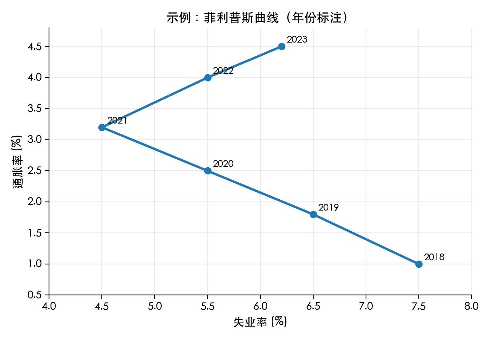

# 通胀与失业（Inflation and Unemployment）

> 宏观经济的两大核心指标，揭示物价稳定与劳动力市场之间的张力。

## 学习目标

- 学会衡量通胀：CPI、PPI、GDP 平减指数的定义与差异。
- 理解失业率、劳动参与率、自然失业率等概念。
- 掌握通胀与失业之间的短期权衡（菲利普斯曲线）及其局限。
- 认识货币政策、财政政策如何影响通胀与就业。
- 能够解读经济报告中的通胀/就业数据，避免常见误区。

## 通胀基本概念

- **通货膨胀 (Inflation)**：整体价格水平持续上涨，货币购买力下降。
- **通货紧缩 (Deflation)**：整体物价持续下降，可能伴随经济衰退。
- 通胀通常以年度变化率表示，例如“同比上涨 2%”。

### 常见通胀指标

| 指标 | 定义 | 关注焦点 | 应用 |
| --- | --- | --- | --- |
| CPI (消费者价格指数) | 一篮子居民消费品与服务价格的变动 | 居民生活成本 | 货币政策、工资调整 |
| PPI (生产者出厂价格指数) | 工业生产者出厂价格变动 | 生产成本、利润空间 | 上游价格压力判断 |
| GDP 平减指数 | 名义 GDP / 实际 GDP × 100 | 全部最终产品与服务 | 整体物价水平 |

> CPI 更贴近消费者感受，PPI 更多反映企业层面的成本变化。

### 通胀成因

- **需求拉动型**：总需求过旺（消费、投资、政府支出、出口强劲）。
- **成本推动型**：原材料、工资等成本上升推动价格上涨。
- **预期驱动型**：大众预期未来物价上涨，提前消费或提价导致自我实现。

## 失业基本概念

- **失业率**：失业人口 / 劳动力人口（正在找工作或准备就业的人）。
- **劳动参与率**：劳动力人口 / 适龄人口。
- **充分就业**：不存在周期性失业，失业率接近 **自然失业率**（结构性 + 摩擦性）。
- **失业类型**：
  - **摩擦性失业**：工作转换期间的短期失业。
  - **结构性失业**：技能结构与岗位需求不匹配。
  - **周期性失业**：经济衰退导致的需求不足。

> 失业率低并不代表没有人失业，而是处于“可接受的低水平”。总会存在摩擦性、结构性失业。

## 通胀与失业的短期权衡：菲利普斯曲线

- 经验发现：在短期内，总需求增加 → 产出与就业上升 → 失业率下降 → 物价压力增加。
- 菲利普斯曲线展示了通胀率与失业率之间的负相关关系。
- **长期局限**：
  - 当预期调整后，通胀与失业之间的 trade-off 不复存在（长期菲利普斯曲线近似垂直）。
  - 经济主体预期高通胀 → 工资谈判、定价提前上调 → 通胀顽固。

## 政策工具与影响

- **货币政策（央行）**：调整利率、存款准备金率、公开市场操作。
  - 紧缩政策 → 降低通胀，但可能导致短期失业上升。
  - 宽松政策 → 刺激需求，降低失业，但可能推高中期通胀。
- **财政政策（政府）**：改变税收、支出。
  - 赤字扩大 → 提振就业，但若过度可能引发通胀风险。
  - 结构调整 → 改善劳动力匹配，降低结构性失业。
- **供给侧政策**：教育培训、技术创新、放松管制，提高潜在产出，降低通胀压力。

## 现实案例：2020-2023 年全球通胀

1. 疫情初期（2020）：需求骤降 → 失业率飙升 → 多国实施刺激政策。
2. 复苏阶段（2021-2022）：供应链瓶颈、需求反弹 → 通胀快速上升。
3. 央行加息（2022-2023）：为抑制通胀紧缩货币政策 → 失业率受到压力，但多数经济体仍维持在较低水平。
4. 启示：政策需要在物价稳定与经济增长之间保持平衡。

## 解读数据时的注意事项

- 看“同比”与“环比”：同比反映年度趋势，环比捕捉短期变化。
- 分析核心 CPI（剔除食品、能源波动），更能观察底层通胀趋势。
- 关注失业率以外的指标：就业人口增长、平均工资、工时、就业质量。
- 考虑地区差异：城市 vs. 农村、不同年龄群体、行业结构。

## 快速自测

1. CPI 上升意味着什么？如果核心 CPI 上升而总体 CPI 持平，可能说明什么？
2. 为什么自然失业率不等于 0？这对政策制定有什么启示？
3. 描述一次你所知的通胀或失业事件，并尝试用需求/供给、政策反应解释。

### 参考答案与解析

1. CPI 上升意味着居民消费篮子总体价格上涨；如果核心 CPI 上升但总体 CPI 持平，可能是能源、食品价格下跌抵消了核心项目上涨，说明潜在的通胀压力仍在积累。
2. 自然失业率包含摩擦性、结构性失业，反映劳动力流动与技能匹配的现实限制。政策应侧重改善就业匹配、培训，而非追求绝对零失业。
3. 示例：某年油价暴涨 → 成本推动通胀；政府通过燃油补贴、释放储备来缓解。或疫情期间服务业停滞 → 失业率上升 → 政府发放补贴、央行宽松以稳定需求。

## 延伸阅读

- 曼昆《宏观经济学》：通胀、货币政策章节
- Blanchard《宏观经济学》：深入讨论菲利普斯曲线与预期
- IMF《世界经济展望》通胀专题
- 各国央行发布的货币政策报告（如美联储、欧洲央行、央行工作论文）

---

建议搭配 `05-gdp-and-growth.md` 一起阅读，理解“增长—通胀—就业”之间的政策权衡。
